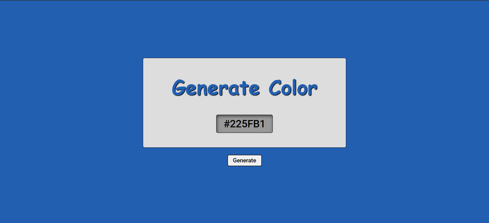

# Color-Generator 🎨

## Generador de colores en formato hexadecimal, genera el color del texto y el del fondo para ver ambos usos.
 

Link al sitio:
[https://generate-color.netlify.app/](https://generate-color.netlify.app/)

 

